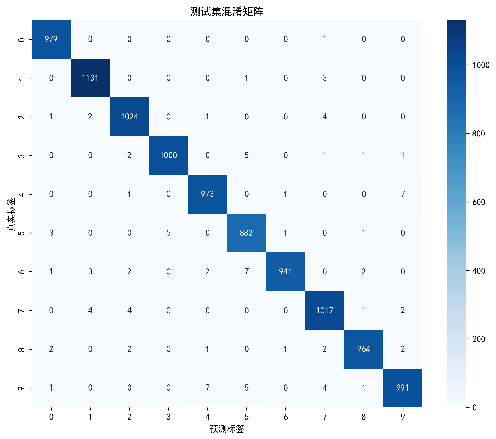

# LeNet-5 手写数字识别算法复现（PyTorch）
> 基于 PyTorch 深度学习框架的经典 LeNet-5 卷积神经网络完整复现，在 MNIST 公开数据集上实现 99.11% 识别准确率，模块化工程结构，全中文注释，CPU/GPU 自动适配，Windows 环境开箱即用。

---

## ✨ 项目亮点
- 🎯 **算法完整复现**：严格还原 LeNet-5 原生网络结构，7 层网络（卷积+池化+全连接），总参数量 61,706
- 📊 **完整评估体系**：支持准确率、精确率、召回率、F1 值多维度指标评估，自动生成训练曲线与混淆矩阵热力图
- 🧩 **模块化工程设计**：配置、模型、数据、训练、可视化完全解耦，代码注释完整，便于学习与二次修改
- 🖥️ **全平台兼容**：自动检测 CUDA 环境，无显卡自动切换 CPU；Windows 多进程兼容，无需额外配置
- 📝 **课程实验友好**：配套完整课程论文，结构规范，可直接作为人工智能课程算法复现实验参考

---

## 📊 实验性能指标
模型在 MNIST 测试集（10,000 张样本）上的完整性能指标如下：

| 评估指标 | 数值 |
| :--- | :---: |
| 测试集总体准确率（Accuracy） | **99.11%** |
| 宏平均精确率（Macro Precision） | 99.10% |
| 宏平均召回率（Macro Recall） | 99.10% |
| 宏平均 F1 值（Macro F1） | 99.10% |

**训练配置**：Batch Size = 64，Epoch = 20，优化器 Adam，初始学习率 0.001，交叉熵损失函数。

---

## 📈 实验可视化结果
### 1. 训练损失 & 准确率变化曲线
训练全程20轮迭代的损失、准确率变化曲线，直观展示模型收敛过程：


左子图：训练/测试损失变化；右子图：训练/测试准确率变化。
曲线分析：模型前5轮快速收敛，训练损失持续稳步下降；训练、测试曲线无巨大鸿沟，无明显过拟合；15轮后指标趋于稳定，模型完全收敛。

### 2. 测试集混淆矩阵热力图
直观展示0~9每类手写数字的识别正误分布：



对角线数值代表正确识别样本，数值越高识别效果越好；少量误判集中在形态近似数字（1与7、3与5、4与9），整体错误样本占比不足1%。

---

## 🧠 算法原理
LeNet-5 由 Yann LeCun 于 1998 年提出，是首个成功商用的卷积神经网络，奠定了现代 CNN 的基础架构。网络核心由「卷积层 + 池化层 + 全连接层」交替堆叠构成，依靠局部感受野、权值共享、池化下采样三大核心机制，自动分层提取图像特征。

**网络层级完整结构**：
1. **输入层**：1×32×32 单通道灰度手写数字图像
2. **C1 卷积层**：6 个 5×5 卷积核，步长1，输出 6@28×28 特征图，提取浅层笔画纹理
3. **S2 最大池化层**：2×2池化窗口，步长2，输出 6@14×14 特征图，压缩特征尺寸
4. **C3 卷积层**：16 个 5×5 卷积核，输出 16@10×10 特征图，提取组合局部特征
5. **S4 最大池化层**：2×2池化窗口，输出 16@5×5 特征图
6. **C5 卷积层**：120 个 5×5 卷积核，输出120维一维高层特征向量
7. **F6 全连接层**：120维映射至84维，ReLU激活引入非线性
8. **输出层**：84维映射至10维，对应0~9十类数字分类输出

---

## 🛠️ 环境要求与依赖安装
### 硬件环境
- 最低配置：Intel i5 及以上CPU、8GB内存（纯CPU训练）
- 推荐配置：4GB显存及以上NVIDIA显卡，支持CUDA加速训练
- 操作系统：Windows 10/11、Linux、macOS 全兼容

### 软件环境
- Python 版本：3.8 ~ 3.12
- 深度学习框架：PyTorch >= 1.10.0

### 一键安装依赖（清华镜像加速）
```bash
pip install torch torchvision torchaudio numpy matplotlib seaborn scikit-learn -i https://pypi.tuna.tsinghua.edu.cn/simple
